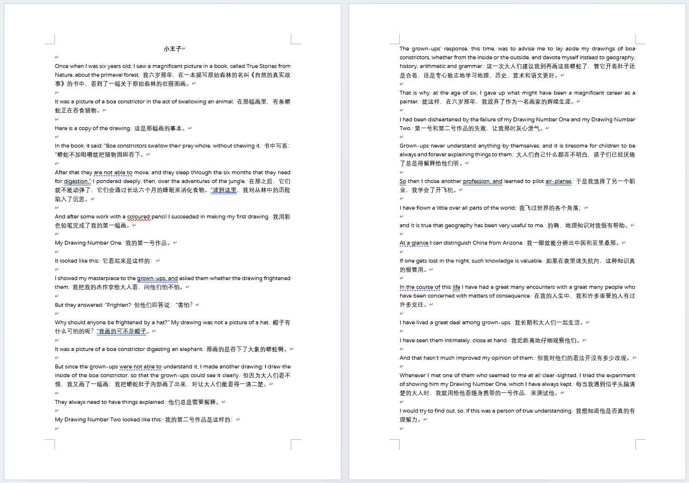
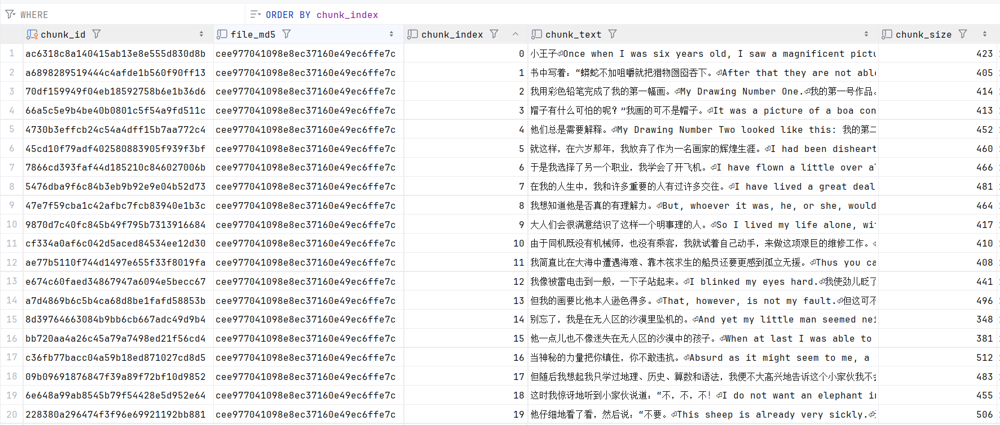

# TikaX

TikaX 是一个基于 Apache Tika 的智能文档处理平台，能够识别、解析多种文档格式并提取纯文本内容，
将解析后的文本使用滑动窗口算法进行分块处理并持久化存储，后续可以直接进行向量化处理。

## 主要功能

1. **多格式文档解析**：
    - 支持 PDF、Word 文档(.docx)、Markdown、TXT 等多种常见文档格式
    - 支持图片识别
    - 使用 Apache Tika 进行文件类型检测和内容解析

2. **文件管理**：
    - 文件上传与存储（使用 MinIO 对象存储）
    - 文件删除与下载（Minio 预签名 URL）

3. **文本处理**：
    - 提取文档中的纯文本内容
    - 文本分块处理（滑动窗口算法）

4. **用户认证**：
    - 用户注册与登录
    - 基于 Spring Security 的安全控制

## 示例

**word 文档**


**分块结果**


## 技术架构

### 后端技术栈

- **核心框架**：Spring Boot 4.0.0
- **安全框架**：Spring Security
- **ORM 框架**：MyBatis 4.0.0
- **数据库**：MySQL
- **缓存**：Redis
- **对象存储**：MinIO
- **文档解析**：Apache Tika 3.2.2
- **辅助工具**：
    - Lombok：简化 Java 代码
    - tess4j：OCR 文字识别
    - commonmark：Markdown 解析
    - Apache POI：Office 文档处理

## 功能实现流程

### 文件上传流程

1. 通过接口上传文件
2. 接收文件并进行基础验证
3. 文件上传至 MinIO
4. 使用 Apache Tika 检测文件 MIME 类型
5. 根据 MIME 类型选择合适的解析器提取文本
6. 对提取的文本进行分块处理
7. 将文件元信息和分块分别存储到数据库
8. 返回处理结果

### 文档解析流程

1. 系统根据文件 MIME 类型在解析器注册表中查找对应解析器
2. 调用相应的解析器实现（PDF、DOCX、TXT 等）
3. 解析器从文件中提取纯文本内容
4. 对提取的文本进行后续处理和存储

### 文本分块流程

1. 使用滑动窗口算法对长文本进行分割
2. 保持语义完整性，在句子边界处切割
3. 添加重叠区域确保上下文连贯性
4. 批量存储文本块到数据库

## 项目依赖

主要第三方依赖包括：

- **Spring 生态**：
    - spring-boot-starter-webmvc：Web MVC 框架
    - spring-boot-starter-security：安全框架
    - spring-boot-starter-data-redis：Redis 集成
    - spring-boot-starter-aop：面向切面编程支持

- **数据存储**：
    - mysql-connector-j：MySQL 数据库驱动
    - mybatis-spring-boot-starter：MyBatis 集成
    - minio：对象存储客户端

- **文档处理**：
    - org.apache.tika:tika-core：Tika 核心库
    - org.apache.tika:tika-parsers-standard-package：标准解析器包
    - org.apache.tika:tika-parser-pdf-module：PDF 解析模块
    - org.apache.poi:poi-ooxml：Office 文档处理
    - org.commonmark:commonmark：Markdown 解析
    - net.sourceforge.tess4j: tess4j：OCR 文字识别

- **工具类**：
    - org.projectlombok:lombok：简化代码工具
    - commons-pool2：对象池化工具

## 表设计

### users

* 用户信息

```sql
CREATE TABLE users
(
    id         BIGINT AUTO_INCREMENT PRIMARY KEY COMMENT '用户唯一标识',
    username   VARCHAR(255)           NOT NULL UNIQUE COMMENT '用户名，唯一',
    password   VARCHAR(255)           NOT NULL COMMENT '加密后的密码',
    role       ENUM ('USER', 'ADMIN') NOT NULL DEFAULT 'USER' COMMENT '用户角色',
    created_at TIMESTAMP                       DEFAULT CURRENT_TIMESTAMP COMMENT '创建时间',
    updated_at TIMESTAMP                       DEFAULT CURRENT_TIMESTAMP ON UPDATE CURRENT_TIMESTAMP COMMENT '更新时间',
    INDEX idx_username (username) COMMENT '用户名索引'
) ENGINE = InnoDB
  DEFAULT CHARSET = utf8mb4 COMMENT ='用户表';
```

### file_upload

* 保存文件上传信息及状态

```sql
CREATE TABLE file_upload
(
    file_md5   VARCHAR(32) PRIMARY KEY COMMENT '文件的MD5值，作为主键唯一标识文件',
    file_name  VARCHAR(255) NOT NULL COMMENT '文件的原始名称',
    total_size BIGINT       NOT NULL COMMENT '文件总大小(字节)',
    file_type  VARCHAR(50)  NOT NULL COMMENT '文件的MIME类型',
    extension  VARCHAR(20)  NOT NULL COMMENT '文件的扩展名',
    mime_type  VARCHAR(50)  NOT NULL COMMENT '文件的MIME类型',
    plain_text LONGTEXT COMMENT '文件文本内容',
    status     INT          NOT NULL DEFAULT 0 COMMENT '文件上传状态：0-上传中，1-已完成',
    user_id    VARCHAR(64)  NOT NULL COMMENT '上传用户的标识符',
    created_at TIMESTAMP             DEFAULT CURRENT_TIMESTAMP COMMENT '文件上传创建时间',
) ENGINE = InnoDB
  DEFAULT CHARSET = utf8mb4 COMMENT ='文件上传记录表';    
```

### document_chunks

* chunk 结果

```sql
    CREATE TABLE document_chunks
    (
        chunk_id    BIGINT AUTO_INCREMENT PRIMARY KEY COMMENT 'chunk唯一标识',
        file_md5    VARCHAR(32) NOT NULL COMMENT '关联的文件MD5值',
        chunk_index INT         NOT NULL COMMENT '文本分块顺序号',
        chunk_text  TEXT        NOT NULL COMMENT '文本块',
        chunk_size  INT         NOT NULL COMMENT 'chunk大小(字符)',
        created_at  TIMESTAMP DEFAULT CURRENT_TIMESTAMP COMMENT 'chunk创建时间'
    ) ENGINE = InnoDB
      DEFAULT CHARSET = utf8mb4 COMMENT ='文档chunk存储表';
```

## 配置要求

- Java 17+
- MySQL 5.7+
- Redis 3.2.1+
- MinIO 对象存储服务器
- Tesseract OCR 引擎（可选，用于图像文字识别）
